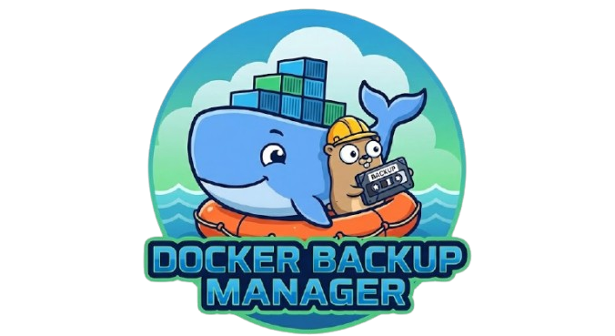

<p align="center">
  
</p>

<h1 align="center">Docker Backup Manager</h1>

<p align="center">
  A powerful, label-driven backup daemon for Docker containers with scheduled backups, multiple storage backends, and a beautiful web dashboard.
</p>

<p align="center">
  <a href="https://shyim.github.io/docker-backup/">Documentation</a> |
  <a href="https://shyim.github.io/docker-backup/getting-started/">Getting Started</a> |
  <a href="https://github.com/shyim/docker-backup/releases">Releases</a>
</p>

---

## Features

- **Label-driven configuration** - Configure backups directly on your containers using Docker labels
- **Multiple backup types** - Support for PostgreSQL, MySQL/MariaDB, and volume backups
- **Flexible storage backends** - Store backups locally or in S3-compatible storage (AWS S3, MinIO, etc.)
- **Scheduled backups** - Cron-based scheduling for automated backups
- **Retention policies** - Automatically clean up old backups
- **Web dashboard** - Beautiful UI to monitor and manage backups
- **Notifications** - Get notified via Telegram or Discord on backup events
- **Restore support** - Easily restore backups with a single command or click

## Quick Start

### Using Docker Compose

```yaml
services:
  docker-backup:
    image: ghcr.io/shyim/docker-backup:latest
    restart: unless-stopped
    command:
      - daemon
      - --dashboard=:8080
      - --storage=local.type=local
      - --storage=local.path=/backups
      - --default-storage=local
    volumes:
      - /var/run/docker.sock:/var/run/docker.sock:ro
      - backup-data:/backups
    ports:
      - "8080:8080"

  # Example: PostgreSQL with backup enabled
  postgres:
    image: postgres:16
    environment:
      POSTGRES_USER: myuser
      POSTGRES_PASSWORD: mypassword
      POSTGRES_DB: myapp
    labels:
      - docker-backup.enable=true
      - docker-backup.db.type=postgres
      - docker-backup.db.schedule=0 3 * * *
      - docker-backup.db.retention=7
    volumes:
      - postgres-data:/var/lib/postgresql/data

volumes:
  backup-data:
  postgres-data:
```

### Container Labels

Configure backups using Docker labels:

```yaml
labels:
  # Enable backup for this container
  - docker-backup.enable=true
  
  # Database backup configuration
  - docker-backup.db.type=postgres        # or mysql
  - docker-backup.db.schedule=0 3 * * *   # Daily at 3 AM
  - docker-backup.db.retention=7          # Keep 7 backups
  - docker-backup.db.storage=s3           # Storage pool name
  
  # Volume backup configuration  
  - docker-backup.files.type=volume
  - docker-backup.files.schedule=0 4 * * *
  - docker-backup.files.retention=14
```

## Backup Types

| Type | Description |
|------|-------------|
| `postgres` | PostgreSQL database backup using `pg_dump` |
| `mysql` | MySQL/MariaDB database backup using `mysqldump` |
| `volume` | Backup all mounted volumes as compressed tarball |

## Storage Backends

| Type | Description |
|------|-------------|
| `local` | Local filesystem storage |
| `s3` | S3-compatible storage (AWS S3, MinIO, DigitalOcean Spaces, etc.) |

## Notification Providers

| Provider | Description |
|----------|-------------|
| `telegram` | Telegram Bot notifications |
| `discord` | Discord webhook notifications |

## Documentation

For full documentation, visit **[shyim.github.io/docker-backup](https://shyim.github.io/docker-backup/)**

- [Installation Guide](https://shyim.github.io/docker-backup/getting-started/installation/)
- [Configuration Reference](https://shyim.github.io/docker-backup/configuration/)
- [CLI Reference](https://shyim.github.io/docker-backup/cli-reference/)
- [Storage Configuration](https://shyim.github.io/docker-backup/configuration/storage/)
- [Notification Setup](https://shyim.github.io/docker-backup/configuration/notifications/)

## CLI Commands

```bash
# Trigger immediate backup
docker exec docker-backup docker-backup backup run my-container

# List backups
docker exec docker-backup docker-backup backup list my-container

# Restore a backup
docker exec docker-backup docker-backup backup restore my-container "backup-key"

# Delete a backup
docker exec docker-backup docker-backup backup delete my-container "backup-key"
```

## License

This project is licensed under the MIT License - see the [LICENSE.md](LICENSE.md) file for details.
